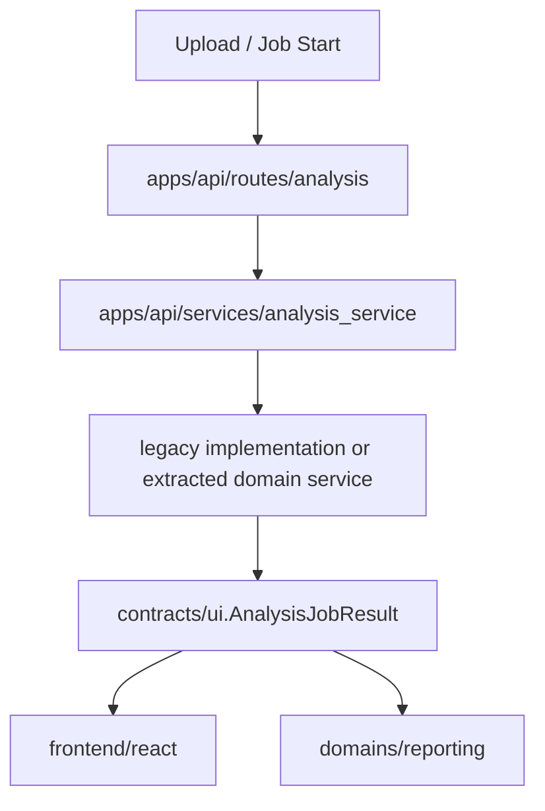
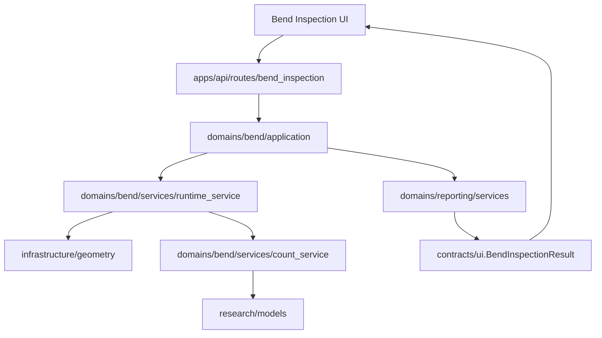
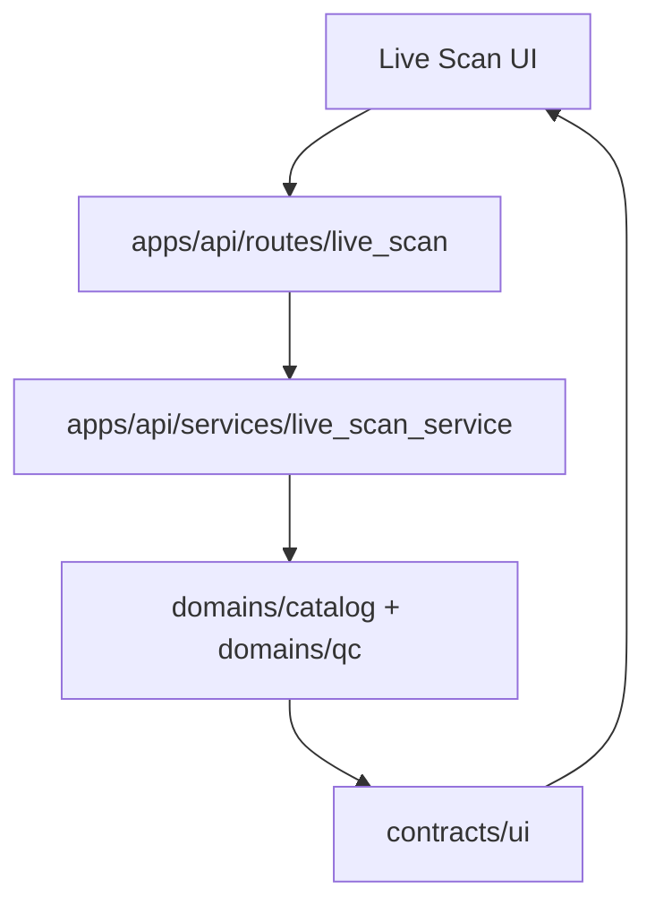

# Runtime Flows

## General QC analysis

```mermaid
flowchart TD
  Upload["Upload / Job Start"] --> ApiRoute["apps/api/routes/analysis"]
  ApiRoute --> Service["apps/api/services/analysis_service"]
  Service --> Legacy["legacy implementation or extracted domain service"]
  Legacy --> Result["contracts/ui.AnalysisJobResult"]
  Result --> Web["frontend/react"]
  Result --> Report["domains/reporting"]
```

## Bend inspection

```mermaid
flowchart TD
  BendUI["Bend Inspection UI"] --> BendRoute["apps/api/routes/bend_inspection"]
  BendRoute --> BendApp["domains/bend/application"]
  BendApp --> Runtime["domains/bend/services/runtime_service"]
  Runtime --> Geometry["infrastructure/geometry"]
  Runtime --> Count["domains/bend/services/count_service"]
  Count --> Unary["research/models"]
  BendApp --> ReportSvc["domains/reporting/services"]
  ReportSvc --> Contract["contracts/ui.BendInspectionResult"]
  Contract --> BendUI
```

## Live scan

```mermaid
flowchart TD
  LiveScan["Live Scan UI"] --> LiveRoute["apps/api/routes/live_scan"]
  LiveRoute --> LiveService["apps/api/services/live_scan_service"]
  LiveService --> Domain["domains/catalog + domains/qc"]
  Domain --> Contract["contracts/ui"]
  Contract --> LiveScan
```
